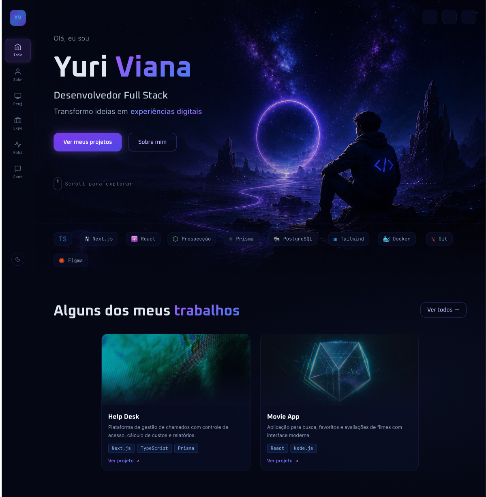
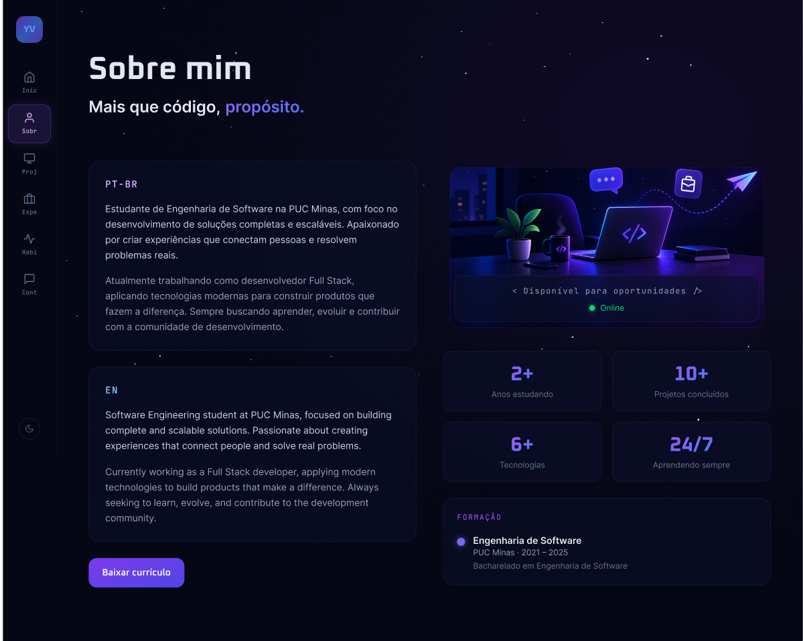
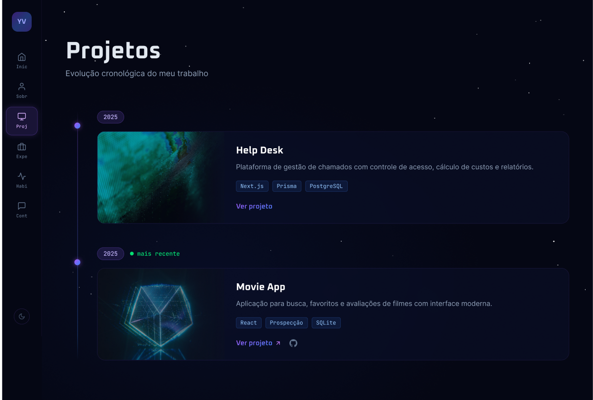
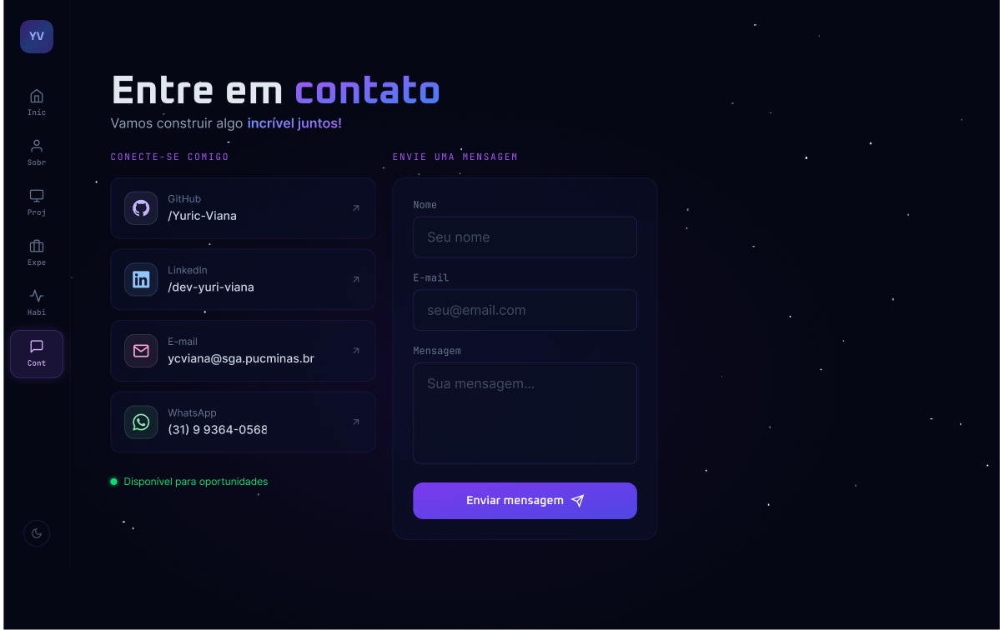

<<<<<<< HEAD
<div align="center">

# 🌌 Yuri Viana — Portfólio Personal

<p align="center">
  <strong>Desenvolvedor Full Stack | Bacharel em Engenharia de Software (PUC Minas)</strong>
</p>

<p align="center">
  <a href="#-sobre-o-projeto">Sobre</a> •
  <a href="#-diferenciais-e-arquitetura">Arquitetura</a> •
  <a href="#-tecnologias">Tecnologias</a> •
  <a href="#-seções-do-site">Seções</a> •
  <a href="#-projetos-em-destaque">Projetos</a> •
  <a href="#-como-executar">Como Executar</a> •
  <a href="#-contato">Contato</a>
</p>

<p align="center">
  
</p>

</div>

---

## 📌 Sobre o Projeto

Este repositório contém o código-fonte do meu **Portfólio Pessoal**, uma aplicação web desenvolvida para apresentar minha trajetória profissional, competências técnicas, formação acadêmica e projetos de software. 

O projeto foi concebido com uma estética *Dark/Space Theme*, focando em **experiência do usuário (UX)**, **alta performance**, **acessibilidade** e **layout responsivo** para todos os tamanhos de tela.

---

## ✨ Diferenciais e Arquitetura

- **Design System consistente:** Desenvolvido do zero no Figma antes da implementação.
- **Internacionalização (i18n):** Suporte a apresentações em Português (PT-BR) e Inglês (EN).
- **Navegação Fluida:** Transições suaves entre as seções da página e páginas de detalhes.
- **Tipagem Estática Total:** Construído com TypeScript para garantir manutenibilidade e segurança no código.
- **Modularização de Componentes:** Componentes reaproveitáveis e desacoplados para facilidade de expansão.

---

## 🛠️ Tecnologias Utilizadas

**Front-end & UI/UX**
* **Next.js / React** — Framework para renderização otimizada e gerenciamento de rotas.
* **TypeScript** — Tipagem estática aplicável a toda a base de código.
* **Tailwind CSS** — Framework CSS utilitário para estilização ágil e responsiva.
* **Figma** — Prototipagem de alta fidelidade da interface.

**Back-end & Banco de Dados**
* **Node.js** — Runtime para construção de APIs e regras de negócio.
* **Prisma ORM** — Mapeamento objeto-relacional para integração simples com o banco.
* **PostgreSQL / SQLite** — Persistência de dados relacional.

**DevOps & Ferramentas**
* **Docker** — Conteinerização para padronização de ambiente de desenvolvimento.
* **Git & GitHub** — Controle de versão e gerenciamento de código.

---

## 🖥️ Seções do Site

### 🏠 Home (Início)
Apresentação inicial com introdução, navegação rápida para projetos, resumo sobre mim e destaque para as tecnologias principais da stack.

<p align="center">
  
</p>

---

### 👤 Sobre Mim
Apresenta o meu perfil profissional, bio em duas línguas (PT-BR e EN), estatísticas de aprendizado e atalho para download do currículo.

<p align="center">
  
</p>

---

### ⚡ Habilidades Tecnológicas
Organização visual do domínio técnico por área (Front-end, Back-end, Banco de Dados e DevOps) acompanhado da lista completa das ferramentas dominadas.

<p align="center">
  
</p>

---

### 💼 Minha Jornada
Linha do tempo interativa relatando minhas experiências profissionais prévias e os projetos acadêmicos desenvolvidos na PUC Minas.

<p align="center">
  
</p>

---

## 📂 Projetos em Destaque

Navegação pelos projetos de forma cronológica, permitindo acessar páginas com o detalhamento completo de cada solução desenvolvida.

| Visão Geral dos Projetos | Detalhes do Projeto (Ex: Movie App) |
|---|---|
|  |  |

#### Principais aplicações registradas:
- **Help Desk:** Plataforma para gestão de chamados, controle de acesso, cálculo de custos e relatórios (Next.js, Prisma, PostgreSQL).
- **Movie App:** Aplicação para busca, gerenciamento de favoritos e avaliação de filmes consumindo a API do TMDB (React, Node.js, SQLite).

---

### 📬 Contato
Área para conexão direta via formulário de e-mail e links para redes profissionais.

<p align="center">
  
</p>
=======
This is a [Next.js](https://nextjs.org) project bootstrapped with [`create-next-app`](https://nextjs.org/docs/app/api-reference/cli/create-next-app).

## Getting Started

First, run the development server:

```bash
npm run dev
# or
yarn dev
# or
pnpm dev
# or
bun dev
```

Open [http://localhost:3000](http://localhost:3000) with your browser to see the result.

You can start editing the page by modifying `app/page.tsx`. The page auto-updates as you edit the file.

This project uses [`next/font`](https://nextjs.org/docs/app/building-your-application/optimizing/fonts) to automatically optimize and load [Geist](https://vercel.com/font), a new font family for Vercel.

## Learn More

To learn more about Next.js, take a look at the following resources:

- [Next.js Documentation](https://nextjs.org/docs) - learn about Next.js features and API.
- [Learn Next.js](https://nextjs.org/learn) - an interactive Next.js tutorial.

You can check out [the Next.js GitHub repository](https://github.com/vercel/next.js) - your feedback and contributions are welcome!

## Deploy on Vercel

The easiest way to deploy your Next.js app is to use the [Vercel Platform](https://vercel.com/new?utm_medium=default-template&filter=next.js&utm_source=create-next-app&utm_campaign=create-next-app-readme) from the creators of Next.js.

Check out our [Next.js deployment documentation](https://nextjs.org/docs/app/building-your-application/deploying) for more details.
>>>>>>> b7cc318 (feat: commit inicial do projeto)
